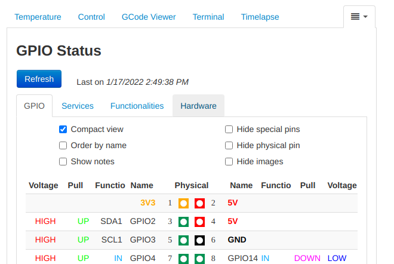

# GPIO Status

This OctoPrint plugin allows to check the GPIO status
by the web interface, without the need to connect via SSH.
It also permits knowing services' status and hardware
information.

## Preliminary note

This plugin doesn't know which pins are in use and which
are free, since its purpose is to just show their state.
Always remember to precisely check every GPIO connection
before turning on the Raspberry according to the datasheet.

## Prerequisites

This plugin must be executed on a Raspberry PI and requires
the two commands __*raspi-config*__ and __*raspi-gpio*__.
They're usually installed by default but, if they are not,
the plugin will show a notification message on its tab.

## Setup

Install via the bundled [Plugin Manager](
https://docs.octoprint.org/en/master/bundledplugins/pluginmanager.html)
or manually using this URL:

    https://github.com/danieleborgo/OctoPrint-GPIOStatus/archive/master.zip

## Screenshots

This is GPIO Status main page with all the view checkboxes:

This is the compact representation of a GPIO:

This plugin is also able to show services status:

These are the Raspberry PI hardware information:

More images are available [here](
https://github.com/danieleborgo/OctoPrint-GPIOStatus/tree/master/docs).

## License

This software is distributed on GPLv3.0, more information
available in [LICENSE.md](
https://github.com/danieleborgo/OctoPrint-GPIOStatus/blob/master/LICENSE.md).