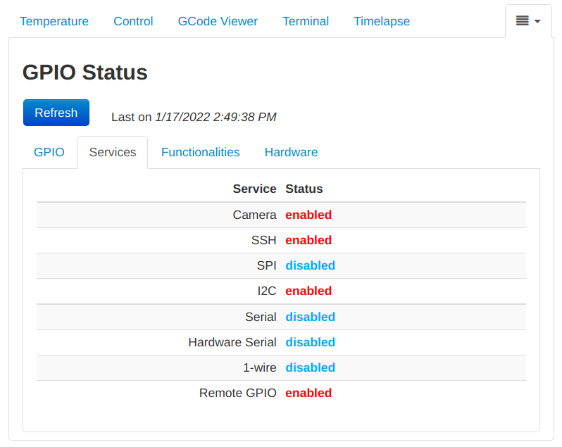
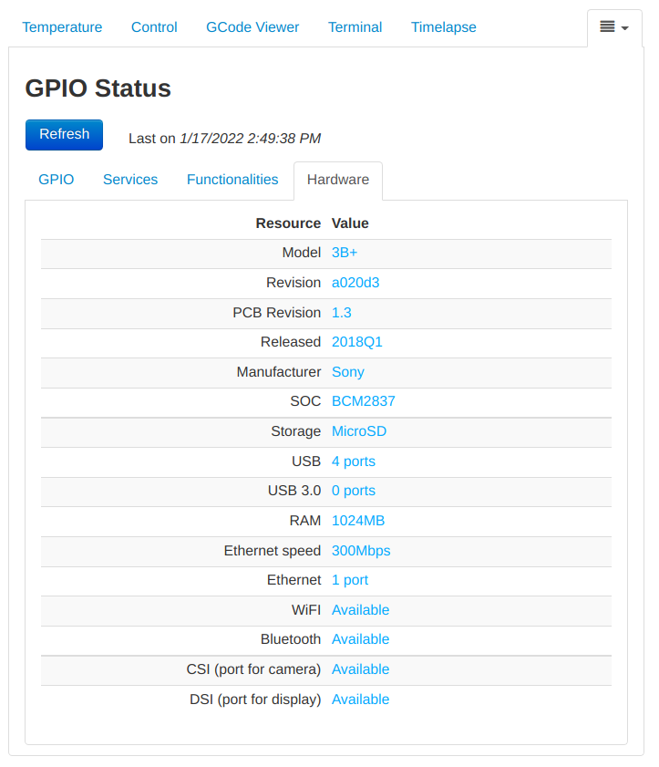

# GPIOStatus

This OctoPrint plugin allows to check the GPIO status
by its web interface, without the need to connect via SSH.
In addition, it permits knowing services' status and
hardware information.

This plugin doesn't know which pins are in use and which
are free, since its purpose is to just show their state.

## Prerequisites

This plugin must be executed on a Rasperry and  requires
the two commands __*raspi-config*__ and __*raspi-gpio*__.
They're usually installed by default but, if they are not,
the plugin will show a notification message on its tab.

## Setup

Install via the bundled [Plugin Manager](https://docs.octoprint.org/en/master/bundledplugins/pluginmanager.html)
or manually using this URL:

    https://github.com/danieleborgo/OctoPrint-GPIOStatus/archive/master.zip

## Screenshots

## License

This software is distributed on GPLv3.0, more information
available in [LICENSE.md](LICENSE.md).